<h1>AI with Databricks</h1>

*Explores the use of AI with Databricks.*

---

**Contents**:

- [KEY POINT: OpenAI-Compatible REST API for Model Access](#key-point-openai-compatible-rest-api-for-model-access)
- [METHOD: Model Serving: Using External Model](#method-model-serving-using-external-model)
  - [Create External Model Provider API Key](#create-external-model-provider-api-key)
  - [Create Model Serving Endpoint](#create-model-serving-endpoint)
  - [Create Databricks Access Token](#create-databricks-access-token)
  - [Testing the Endpoint via Python](#testing-the-endpoint-via-python)
- [METHOD: Model Serving: Using Built-In Model](#method-model-serving-using-built-in-model)
- [METHOD: AI Gateway](#method-ai-gateway)
  - [View AI Gateway Tab](#view-ai-gateway-tab)
  - [Create AI Gateway Endpoint (*if required*)](#create-ai-gateway-endpoint-if-required)
  - [Create Databricks Access Token](#create-databricks-access-token-1)
  - [Testing the Endpoint via cURL](#testing-the-endpoint-via-curl)
  - [Testing the Endpoint via Python](#testing-the-endpoint-via-python-1)
- [Using AI Playground](#using-ai-playground)

---

# KEY POINT: OpenAI-Compatible REST API for Model Access
Databricks Mosaic AI Model Serving and the Unity AI Gateway expose a unified, OpenAI-compatible REST API across all supported foundational LLMs. This standardizes the interface, allowing you to use standard openai library code to query Anthropic Claude models natively or externally hosted within your Databricks workspace.

# METHOD: Model Serving: Using External Model
> **NOTE**: *This consumes credits from the model provider and not Databricks credits. The model serving endpoint acts merely as a middleman to route API requests and responses.*

In this example:

- External model provider: OpenAI
- Model used: `gpt-5-mini`

> *While this example is for OpenAI, the same broad approach applies for any external model.*

## Create External Model Provider API Key
For OpenAI, go to the following:

[**platform.openai.com/api-keys**](https://platform.openai.com/api-keys)

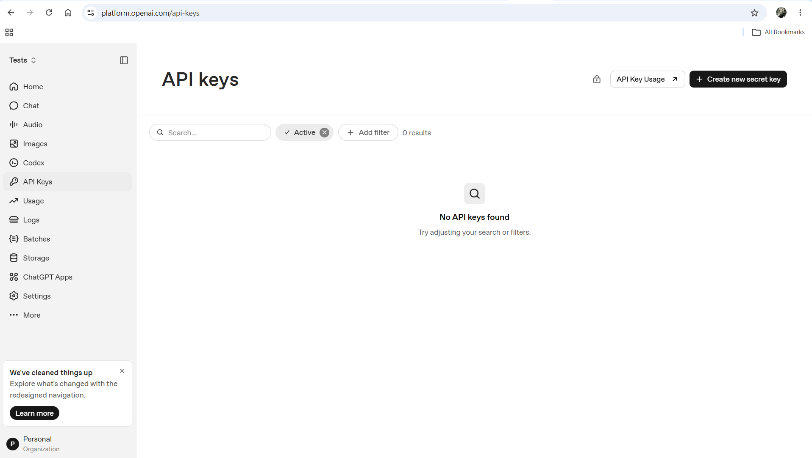

> **NOTE**: *To access the above page for your purposes, you may have to create an OpenAI organisation account, but although it is called "organisation account", it can be used for personal use with no added steps. In my case, I have named my organisation "Personal", indicating that it is for personal use.*

Create either a personal API key or a service account.

***Ensure you copy the API key secret for future use.***

## Create Model Serving Endpoint
- Login to your Databricks account and go to your workspace
- Go to the "Serving" tab under "AI/ML" in the sidebar

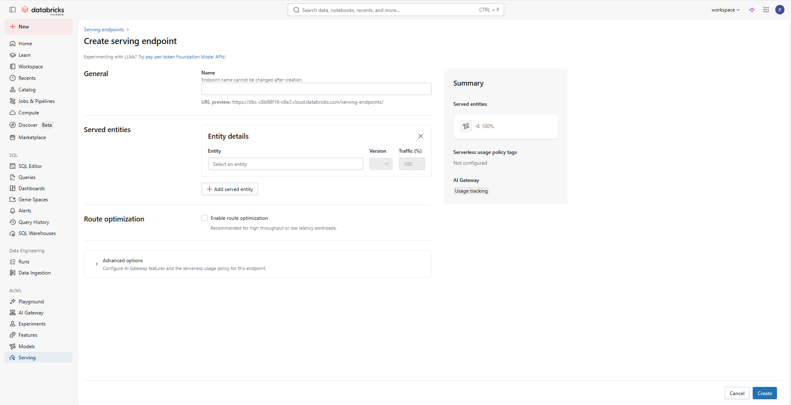

For this example, we will select a model from the "External model providers" section in the dropdown we get when we go into the "Entity" entry box, select the "Foundational models" option and go through the options within this. This is how the pop-up box looks like:

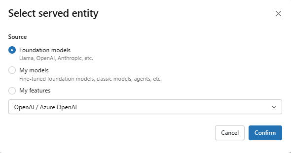

The result is as follows (after naming the model endpoint to `test-openai-endpoint`):

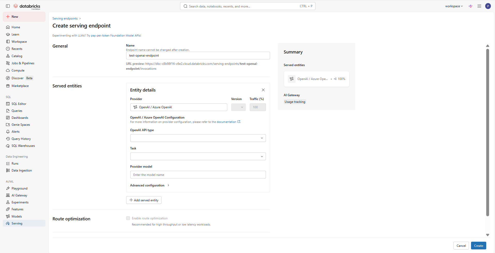

> *Notice that "Entity" has been renamed to "Provider" here.*

After choosing the "OpenAI API type" as "OpenAI":

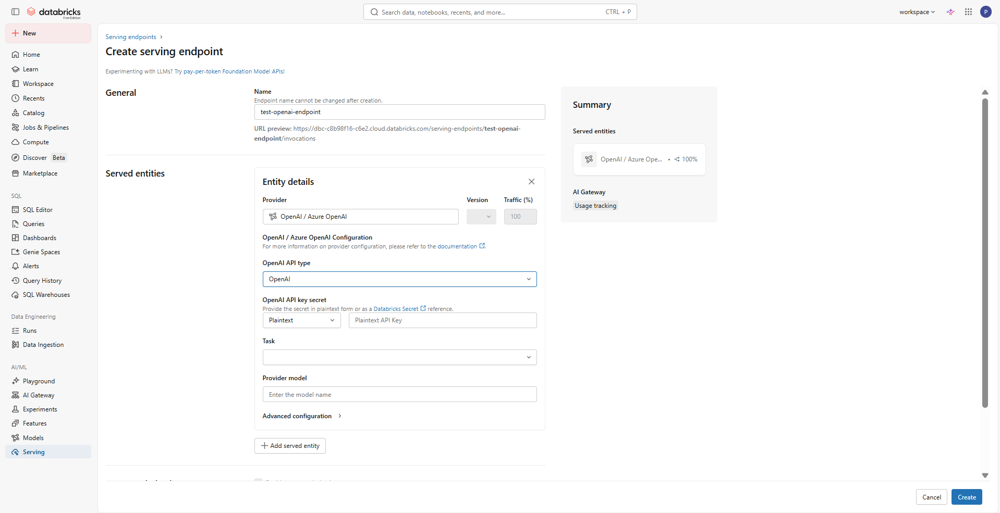

In the "OpenAI API key secret" entry, add the API key secret generated and copied in the previous section. This is what Databricks will use to authorise its requests to the external model. Finally, specify the "Task type" (in this example, "Chat" is chosen) and "Provider model" to be used (in this example, `gpt-5-mini` is given):

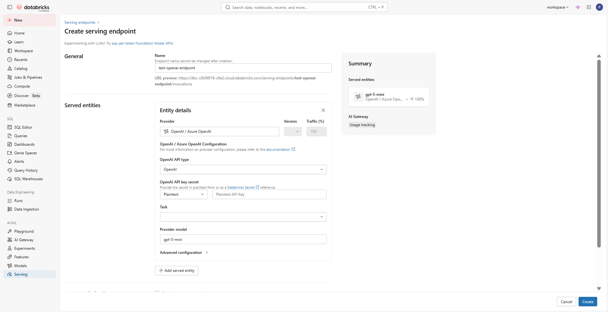

Hit "Create".

## Create Databricks Access Token
**See**: [`create-databricks-access-token.md`](./create-databricks-access-token.md)

For this case, add `model-serving` to the API scope(s).

Copy the generated key for future use.

## Testing the Endpoint via Python
**See**: [`scripts/model-serving-example.py`](./scripts/model-serving-example.py)

The Databricks access token has to be provided here for authorisation. The Databricks access token allows authorisation for model serving endpoint access, while the provider's API key secret given within the endpoint's configuration allows authorisation for the external model itself. The routing is as follows:

```
user --(request)-->
    --(databricks access token)--> model serving endpoint
        --(provider api key secret)--> external model
            --(response)--> model serving endpoint
                --(response)--> user
```

> **Reference**: [*Tutorial: Create external model endpoints to query OpenAI models*, **docs.databricks.com/gcp/en/generative-ai/tutorials**](https://docs.databricks.com/gcp/en/generative-ai/tutorials/external-models-tutorial)

---

> **NOTE**: *There is a cURL equivalent for this.*

# METHOD: Model Serving: Using Built-In Model
> **NOTE**: *This consumes Databricks credits.*

This has a very similar approach to [METHOD: \[Model Serving\] Using External Model](#method-model-serving-using-external-model), but without the need to concern with the provider's API key. There are other settings that become relevant with built-in models (such as "Provisional Throughput") but these shall not be discussed for now. An illustrated example is shown below for the built-in model Llama 4 Maverick:

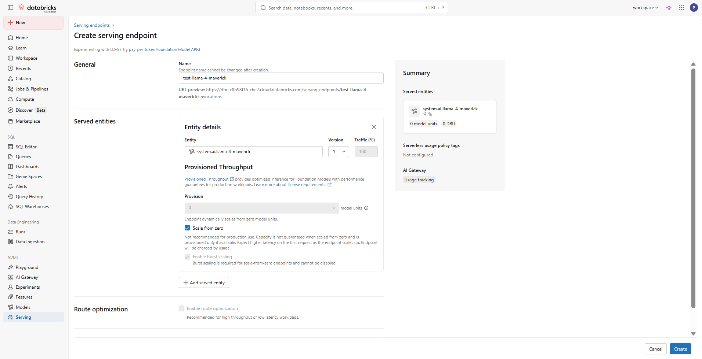

# METHOD: AI Gateway
> **NOTE**:
> 
> - If using Databricks-hosted models: <br> *Consumes Databricks credits*
> - If using external provider models: <br> *Consumes external provider credits*

## View AI Gateway Tab
- Login to your Databricks account and go to your workspace
- Go to the "AI Gateway" tab under "AI/ML" in the sidebar

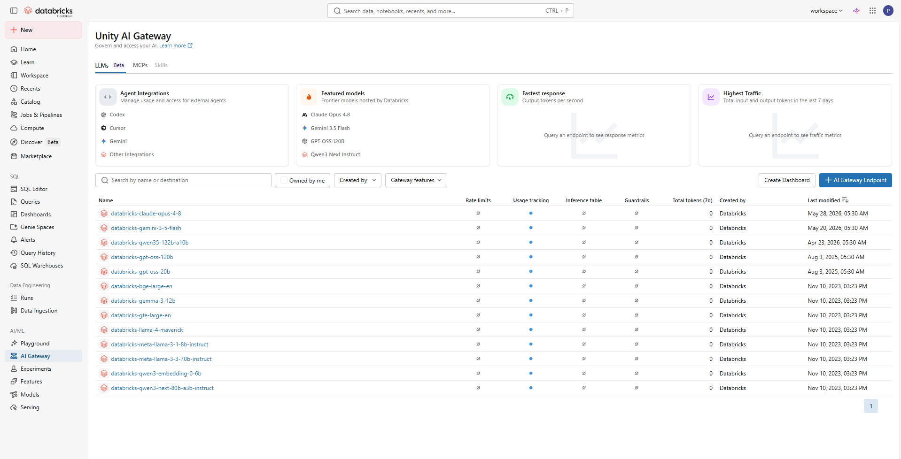

Here is an example of an existing AI gateway endpoint:

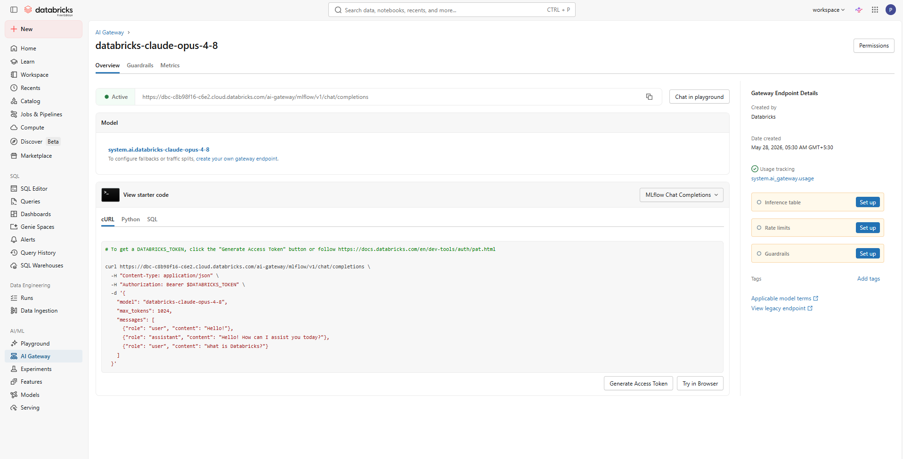

## Create AI Gateway Endpoint (*if required*)
Select "+ AI Gateway Endpoint" below:


Here is how the creation page looks like (showing Databricks-hosted models):

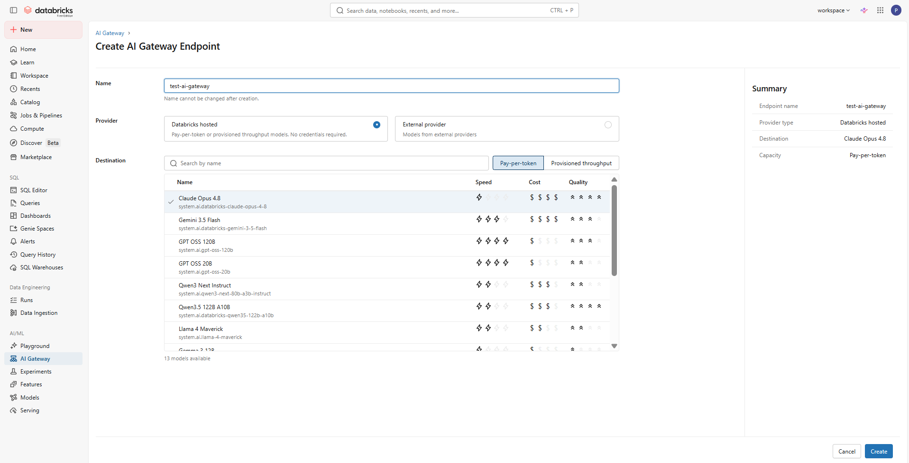

Here is how the creation page looks like (showing external provider models):

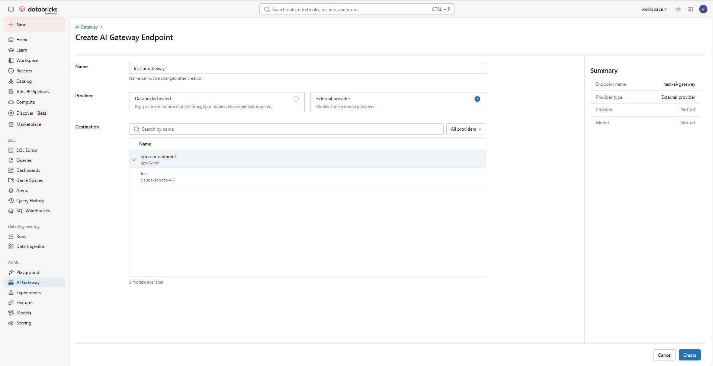

> **NOTE**: *Notice that you can select your own external-provider-using serving endpoint here. In this case, 2 model serving endpoints created by me (`open-ai-endpoint` and `test`) are also visible in the options.*

## Create Databricks Access Token
**See**: [`create-databricks-access-token.md`](./create-databricks-access-token.md)

For this case, add `ai-gateway` to the API scope(s).

Copy the generated key for future use.

## Testing the Endpoint via cURL
[`scripts/ai-gateway-example.curl`](./scripts/ai-gateway-example.curl)

## Testing the Endpoint via Python
[`scripts/ai-gateway-example.py`](./scripts/ai-gateway-example.py)

# Using AI Playground
AI Playground in Databricks offers a web UI to test:

- AI gateway endpoints
- Model serving endpoints
