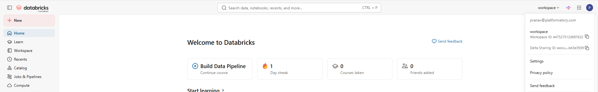
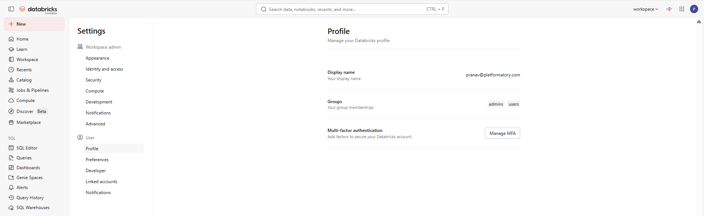
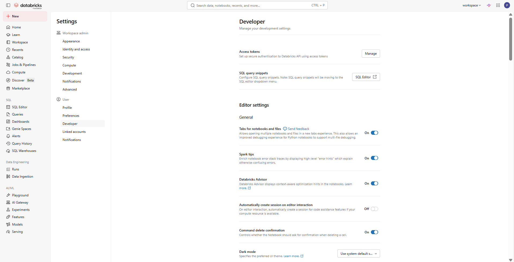
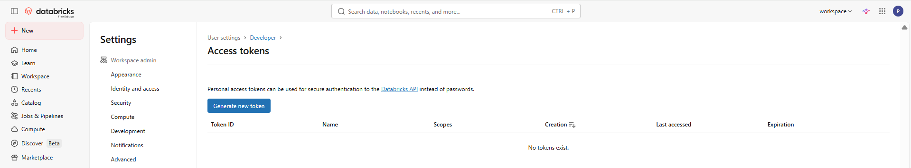
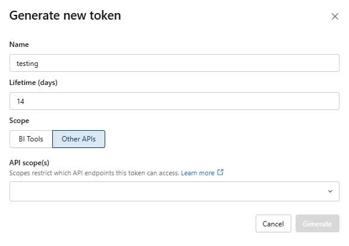
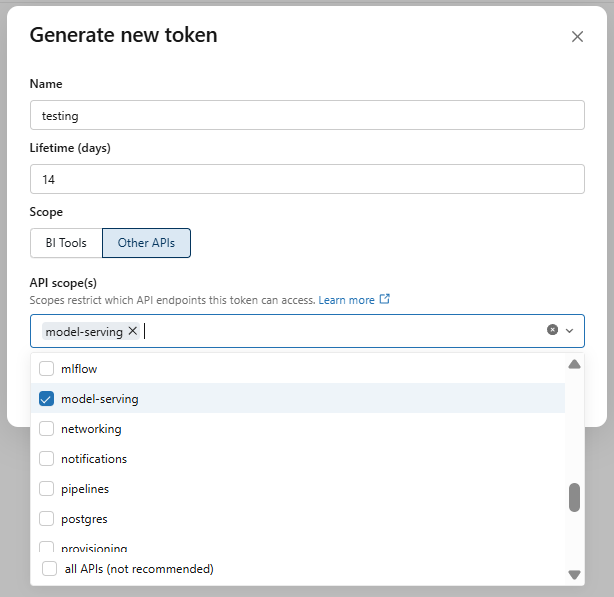

**How-To**

<h1>Create Databricks Access Token</h1>

---

Go to your account's settings:

*Select "Settings" below*...

*You shall arrive at this page*...

Select the "Developer" tab:

> **NOTE**: *This option is only available with admin access.*

Click "Manage" beside the "Access tokens" section:

Click on "Generate new token"; you will get a pop-up like this:

Add the API scope(s) from the dropdown as appropriate.

| E.g.: Adding `model-serving` |
| --- |
|  |

> **NOTE**:
> 
> - We can add multiple API scopes for a single access token
> - Putting the scope as `all APIs` allows the token to access any API   ... *This is generally not recommended due to safety concerns*

Copy the generated key for future use.