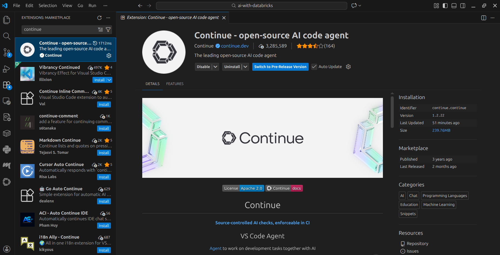
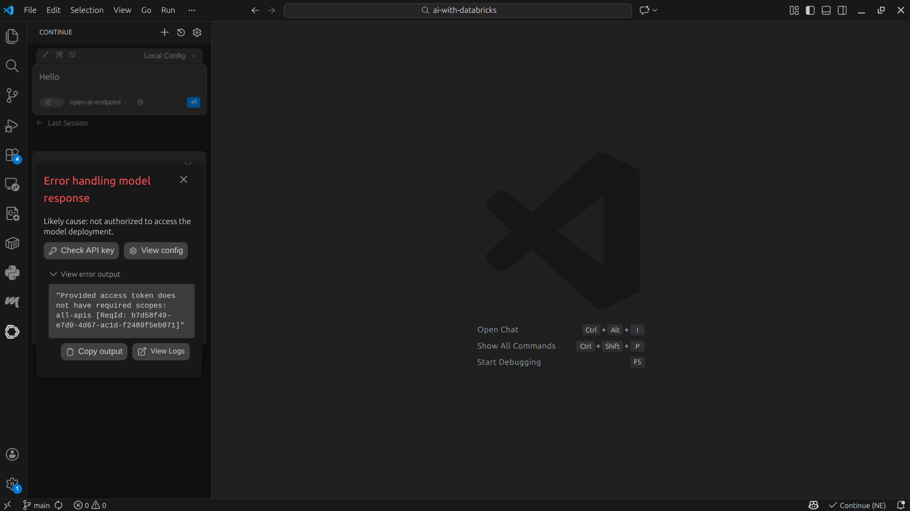
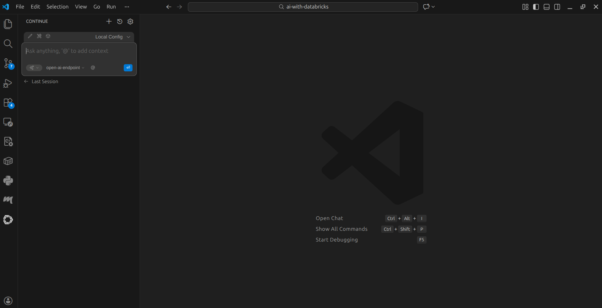

<h1>Integrate Databricks AI Endpoint to IDE</h1>

> **CAUTION**: This document's contents are still pending verification and updates.

---

**Contents**:

- [Goal](#goal)
- [Context](#context)
  - [About Continue](#about-continue)
  - [About VS Code](#about-vs-code)
  - [VS Code Extension for Continue](#vs-code-extension-for-continue)
- [Setup](#setup)
  - [Install VS Code](#install-vs-code)
  - [Install the Continue Extension for VS Code](#install-the-continue-extension-for-vs-code)
  - [Setup Endpoint](#setup-endpoint)
  - [Configure Continue](#configure-continue)
    - [Open Configuration File](#open-configuration-file)
    - [Add AI Endpoint Details to Configuration File](#add-ai-endpoint-details-to-configuration-file)
    - [KEY POINT: Use Databricks Access Token Scoped to `all APIs`](#key-point-use-databricks-access-token-scoped-to-all-apis)
    - [Save the Configuration File](#save-the-configuration-file)
    - [Open Continue Chat UI in VS Code](#open-continue-chat-ui-in-vs-code)

---

# Goal
The goal is as follows:

- Use the chat interface available through an IDE
- Access and communicate with one of the following:
    - Databricks Model Serving Endpoint
    - AI Gateway Endpoint
- ***Use Databricks credits to use AI models***
- Circumvent provider-specific accounts and interfaces

# Context
## About Continue
Continue (also called Continue.dev) is an open-source AI coding agent available as a CLI, VS Code extension, and JetBrains plugin. It is licensed under Apache 2.0, and provides chat, autocomplete, and agentic coding features within an IDE. It is provider-agnostic; rather than being tied to a single model or service, it supports a wide range of LLM providers through a unified configuration interface, including any OpenAI-compatible endpoint.

> **References**:
> 
> - [`continuedev`/`continue`, **github.com**](https://github.com/continuedev/continue); see:
>   - Repository's README
>   - The provider list in `core/llm/llms/index.ts`
> - [**www.continue.dev**](https://www.continue.dev/)

## About VS Code
VS Code (Visual Studio Code) is a free, open-source code editor developed by Microsoft, first released in 2015. It runs on Windows, macOS, and Linux, and has become one of the most widely used editors due to its extensibility, built-in Git support, and large ecosystem. At its heart, Visual Studio Code features a lightning fast source code editor, but you can install any number of third-party extensions to add further functionality to the core VS Code IDE.

> **Reference**: [*Why did we build Visual Studio Code?*, **code.visualstudio.com/docs/editor**](https://code.visualstudio.com/docs/editor/whyvscode)

## VS Code Extension for Continue
The VS Code extension packages Continue's functionality as a standard VS Code extension, installable from the VS Code Marketplace. Once installed, it adds a dedicated chat side panel to the VS Code UI, inline code editing commands, and autocomplete suggestions within the editor itself. The extension reads from `~/.continue/config.yaml` (`~` here refers to the home directory in Ubuntu; for Windows, this path may differ) to determine which models and providers to use, meaning the IDE integration is entirely configuration-driven, with no code changes required. The extension's Marketplace listing is at [`marketplace.visualstudio.com/items?itemName=Continue.continue`](https://marketplace.visualstudio.com/items?itemName=Continue.continue), and its source is in the `extensions/vscode` directory of the Continue.dev monorepo (see: [`continuedev`/`continue`, **github.com**](https://github.com/continuedev/continue)).

> **Reference**: [`continuedev`/`continue`/`extensions`/`vscode`, **github.com**](https://github.com/continuedev/continue/tree/main/extensions/vscode)

# Setup
## Install VS Code
**See**: [**code.visualstudio.com/download**](https://code.visualstudio.com/download)

## Install the Continue Extension for VS Code
You can do this within VS Code, using the extensions tab in the sidebar:



> You can also access its Marketplace listing online:
> 
> **See**: [`marketplace.visualstudio.com/items?itemName=Continue.continue`](https://marketplace.visualstudio.com/items?itemName=Continue.continue)

## Setup Endpoint
Possible approaches:

- [`approach--model-serving--using-external-model.md`](./approach--model-serving--using-external-model.md)
- [`approach--model-serving--using-built-in-model.md`](./approach--model-serving--using-built-in-model.md)
- [`approach--ai-gateway.md`](./approach--ai-gateway.md)

> **NOTE**: The Databricks access token must be scoped to `all APIs`.
> 
> **See**: ["KEY POINT: Use Databricks Access Token Scoped to `all APIs`" in this document](#key-point-use-databricks-access-token-scoped-to-all-apis)

## Configure Continue
### Open Configuration File
In your system, open:

```
~/continue/config.yaml
```

If freshly installed, the file's contents would look like this:

```yaml                                                                     
name: Local Config
version: 1.0.0
schema: v1
models: []
```

### Add AI Endpoint Details to Configuration File
We only need to list items under `models`, in the following format:

```yaml
- name: <your-databricks-ai-endpoint-name>
  provider: <your-endpoint-provider> # will always be openai, since we are using OpenAI-compatible APIs
  model: <model-chosen-for-your-ai-endpoint> # must match your endpoint's model name exactly; e.g. gpt-5-mini
  apiBase: <base-url> # See below
  apiKey: <your-databricks-access-token> # scoped to all APIs (see the next section for details)
  roles:
    - chat
```

Base URLs:

- For model-serving endpoint: <br> `https://<your-databricks-workspace-id>.cloud.databricks.com/serving-endpoints/<your-databricks-ai-endpoint-name>/invocations`
- For AI Gateway endpoint: <br> `https://<your-databricks-workspace-id>.cloud.databricks.com/ai-gateway/mlflow/v1`

This is how the above would sit in the configuration file:

```yaml                                                                     
name: Local Config
version: 1.0.0
schema: v1
models:
  - name: <your-databricks-ai-endpoint-name>
    provider: <your-endpoint-provider>
    model: <model-chosen-for-your-ai-endpoint>
    apiBase: <base-url>
    apiKey: <your-databricks-access-token>
    roles:
      - chat
```

> **NOTE**: You can add multiple models in the same way.

### KEY POINT: Use Databricks Access Token Scoped to `all APIs`
Using a Databricks acces token not scoped to `all APIs` would lead to the following error:



> To see how to open the above chat UI, see ["Open Continue Chat UI in VS Code" in this document](#open-continue-chat-ui-in-vs-code).

Viewing the complete error logs:

```log
[@continuedev] error: HTTP 403 Forbidden from https://<redacted>.cloud.databricks.com/serving-endpoints/open-ai-endpoint/invocations/responses
{"error_code":403,"message":"Provided access token does not have required scopes: all-apis [ReqId: c1012946-f219-4fa3-9378-25c2727b68f4]"} {"context":"llm_stream_chat","model":"gpt-5-mini","provider":"openai","useOpenAIAdapter":true,"streamEnabled":true,"templateMessages":false}
```

> **NOTE**: Here, I am using a previously created model serving endpoint called `open-ai-endpoint`.

### Save the Configuration File


### Open Continue Chat UI in VS Code
**Shortcut**: `Cmd + L` or `Ctrl + L`

> **NOTE**: You can access Continue-related commands in VS Code by:
> 
> 1. Going to "Help >> Show All Commands" in the menu bar (shortcut: `Cmd + Shift + P` or `Ctrl + Shift + P`)
> 2. Searching "Continue" in the search bar

The chat UI would look something like this:



Notice:

- You can select and use the model you added in the configuration file
- In the above image, I have selected my model serving endpoint `open-ai-endpoint`
- In the configuration file, you can add multiple models, then select any one in the chat UI <br> **See**: ["Add AI Endpoint Details to Configuration File" in this document](#add-ai-endpoint-details-to-configuration-file)